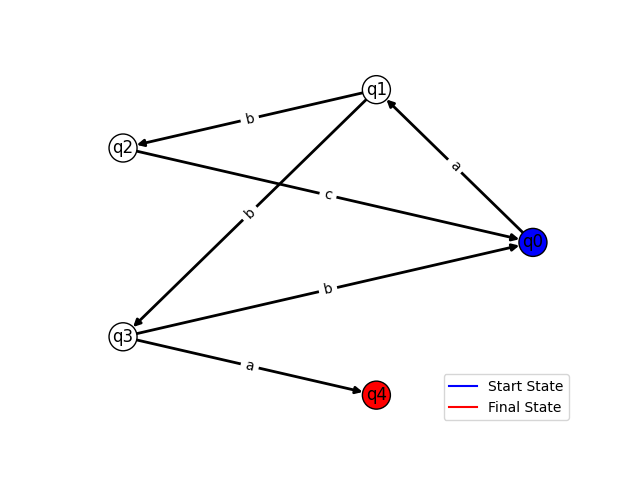
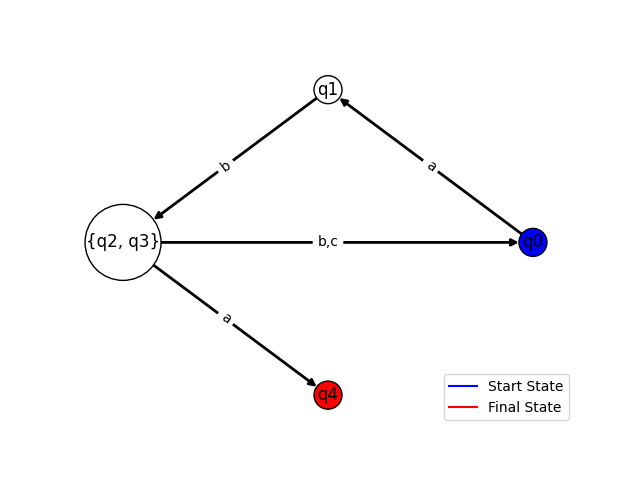

# Determinism in Finite Automata. Conversion from NDFA 2 DFA. Chomsky Hierarchy.

### Course: Formal Languages & Finite Automata
### Author: Crucerescu Vladislav
### Variant: 9

----

## Theory

Finite Automata and Regular Grammars are two strongly related concepts. They can be converted from one to another. 
There are 4 types of grammars, called Chomsky Types, which describe the limitations they have:

__Type 0__
Any form of string conversion.
__Type 1__
The condition string can have more than one character. Can't convert to empty string.
__Type 2__
The condition string has only one non-terminal character. Can convert into any configuration of strings made from non-terminals and terminals.
__Type 3__
The condition string has only one non-terminal character. Can convert to strings of form T, TN or T, NT, where T are terminals and N are non-terminals.

Only a grammar of type 3 can be converted to a Finite Automaton and vice-versa.
Finite Automata can be deterministic or non-deterministic. If from a state, using one character, we can transition to two or more different states, then the finite automaton is regarded as non-deterministic. It is possible to convert a non-deterministic finite automaton to a deterministic through the use of an algorithm.

## Objectives:

1. Understand what an automaton is and what it can be used for.

2. Continuing the work in the same repository and the same project, the following need to be added:
    a. Provide a function in your grammar type/class that could classify the grammar based on Chomsky hierarchy.

    b. For this you can use the variant from the previous lab.

3. According to your variant number (by universal convention it is register ID), get the finite automaton definition and do the following tasks:

    a. Implement conversion of a finite automaton to a regular grammar.

    b. Determine whether your FA is deterministic or non-deterministic.

    c. Implement some functionality that would convert an NDFA to a DFA.
    
    d. Represent the finite automaton graphically (Optional, and can be considered as a __*bonus point*__):
      
    - You can use external libraries, tools or APIs to generate the figures/diagrams.
        
    - Your program needs to gather and send the data about the automaton and the lib/tool/API return the visual representation.

## Implementation description

__Chomsky Type Identifier__

For the chomsky type identification, we can consider every transition in the transition set as its own grammar. Below is the "truth table" that we will change as we check more transitions.

```
types = [0, 0, 0, 1]
left = 0
right = 0
```

Below, I identify the chomsky type for each transition.

Type 0 - the condition string is not in the non-terminals, meaning it has more than one element and the number of elements in the result string is larger than the number of elements in the condition string.
Type 1 - the condition string is not in the non-terminals.

```
no_condition = self.no_elements(condition)
no_result = self.no_elements(result)
if condition not in self.non_terminal_chars:
    if no_result < no_condition:
        return 0
    types[1] = 1
```

Type 2 - the number of non-terminals in the result string is larger than one or the terminals are situated both on the right and left side of the one non-terminal.
Type 3 - only a non-terminal in the condition and result string. The terminal characters must be all on one side of the non-terminal, left or right.

```
count = 0
for i in self.non_terminal_chars:
    if i in result:
        count += 1
        non_terminal_in_result = i
if count > 1:
    types[2] = 1
elif count and no_result > no_condition:
    pos = result.find(non_terminal_in_result)
    if pos == len_result - len(non_terminal_in_result):
        left = 1
    elif pos == 0:
        right = 1
    else:
        types[2] = 1
    if left and right:
        types[2] = 1
elif count:
    types[2] = 1
```

Out of all the chomsky types of the transitions, the "lowest" is chosen. If for example only one transition has a chomsky type of 0, then the whole grammar is type 0.

```
for i in range(4):
    if i == 3 and right:
        return (3,'right')
    if i == 3 and left:
        return (3,'left')
    if types[i]:
        return i
```

The no_elements function counts the number of characters in the string, this is needed because a string might have a non-terminal that is several characters long.

```
no = 0
for i in self.non_terminal_chars:
    no += string.count(i)
    string = string.replace(i, '')
for i in self.terminal_chars:
    no += string.count(i)
```

__FA to Grammar Convertor__

The following method uses a for loop that iterates through the delta function of the FA and adds the transitions in the transition set under the grammar format. For the delta where the result state is in the final states, the transition will have a result string made only out of the character from the respective delta. During the loop, it is checked whether the FA state is not in the new non-terminal set, if so, it is added.

```
for init_state, char, result_state in fa.delta_function:
    if str(result_state) in str(fa.final_states):
        newtransition.append([str(init_state), char])
    else:
        newtransition.append([str(init_state), char + str(result_state)])
    if str(init_state) not in newnon_terminal:
        newnon_terminal.append(str(init_state))
```

__FA Determinism Identifier__

The method below uses double for loops iterating over the delta function counting the amount of similar initial states and characters. If the count is larger than the amount of transitions in the delta function, then the FA is non-deterministic.

```
count = 0
for init_state1, char1, __ in self.delta_function:
    for init_state2, char2, __ in self.delta_function:
        if init_state1 == init_state2 and char1 == char2:
            count += 1
if count > len(self.delta_function):
    return False
return True
```

__NFA to DFA convertor__

The following method uses a while loop checking if there are items in the current states list. This algorithm requires two helping temporary lists. The first temporary list gathers all the transitions from the delta that have the initial state as the current state, or if the initial states are a component of the current state. The second temporary list is a list of all possible transitions made out of the current state and the alphabet of the NFA, note that the result states are currently empty.
```
current_states = [fa.initial_state]
while len(current_states) > 0:
    temp1 = get_transitions(fa.delta_function, current_states[0])
    temp2 = [[current_states[0], i, []] for i in fa.alphabet]
```

The next step is to "merge" the lists. By iterating through temp1 and temp2, we check if the characters match, adding the result state from temp1 to the result state of temp2.
```
    for __, char1, result_state1 in temp1:
        for __, char2, result_state2 in temp2:
            if char1 == char2 and result_state1 not in result_state2:
                result_state2.append(result_state1)
```

The next step is to add the evaluated current state to the new states. Then by iterating through the temp2 list, check which result state are not empty and append the whole transition to the new transition set. The result states that are not in the current states and not in the new states are appended to the current states for evaluation. 
```
    newstates.append(current_states.pop(0))
    for init_state, char, result_state in temp2:
        if len(result_state) != 0:
            reduced_final_state = reduce_list(result_state)
            newtransition.append([init_state, char, reduced_final_state])
            if reduced_final_state not in current_states and reduced_final_state not in newstates: 
                current_states.append(reduced_final_state)
```

The last step identifies which of the new states is a final state. A final state may be a list of strings or a string, therefore two methods must be used.
```
if type(fa.final_states) == list:
    for state in newstates:
        for final in fa.final_states:
            if final in state:
                newfinal.append(state)
else:
    for state in newstates:
        if fa.final_states in state:
            newfinal.append(state)
```

The get_transitions function takes in the delta function and a current state. By iterating through the delta function and the current state, we find the equivalent delta functions to the current state.s
```
if type(state) == list:
    for component_state in state:
        for init_state, char, result_state in delta_function:
            if component_state == init_state:
                transitions.append([state, char, result_state])
for init_state, char, result_state in delta_function:
    if state == init_state:
        transitions.append([state, char, result_state])
```

The reduce_list function takes in the list, if the list has only one state, it returns the element, else it returns the whole list.

```
if len(list) == 1:
    return list[0]
else:
    return list
```

__Graph representation of the FA__

The method for the graphical representation uses the networkx python library. It does not have an algorithmic implementation, it only adds the nodes, them being the states, and the edges being the delta. The initial and the final states are colored blue and red respectively.

## Results

Executing the following main.py file, we produce:

__Task 2__

```
Vn = ['S', 'B', 'D', 'Q']
Vt = ['a', 'b', 'c', 'd']
P = [
    ['S', 'aB'],
    ['S', 'bB'],
    ['B', 'cD'],
    ['D', 'dQ'],
    ['Q', 'bB'],
    ['D', 'a'],
    ['Q', 'dQ']
]
grammar = Grammar(Vn, Vt, P)
print(f"Chomsky Type of Grammar is: {grammar.chomsky_type()}\n")
```
```
Chomsky Type of Grammar is: (3, 'left')
```

__Task 3__

```
Q = ['q0', 'q1', 'q2', 'q3', 'q4']
sigma = ['a', 'b', 'c']
delta = [
    ['q0', 'a', 'q1'],
    ['q1', 'b', 'q2'],
    ['q2', 'c', 'q0'],
    ['q1', 'b', 'q3'],
    ['q3', 'a', 'q4'],
    ['q3', 'b', 'q0']
]
q0 = 'q0'
F = 'q4'
fa = FiniteAutomaton(Q, sigma, delta, q0, F)
convert = Convertor()
print(f"Converted Finite Automaton to {convert.fa_to_grammar(fa)}")
print(f"This Finite Automaton is deterministic: {fa.is_deterministic()}\n")
dfa = convert.nfa_to_dfa(fa)
print(f"Converted Non-Deterministic Finite Automaton to Deterministic {dfa}")
```
```
Converted Finite Automaton to Regular Grammar:
    Vn = ['q0', 'q1', 'q2', 'q3']
    Vt = ['a', 'b', 'c']
    P = 
    ['q0', 'aq1']
    ['q1', 'bq2']
    ['q2', 'cq0']
    ['q1', 'bq3']
    ['q3', 'a']
    ['q3', 'bq0']

This Finite Automaton is deterministic: False

Converted Non-Deterministic Finite Automaton to Deterministic Finite Automaton:
    Q = ['q0', 'q1', ['q2', 'q3'], 'q4']
    Sigma = ['a', 'b', 'c']
    Delta = 
    ['q0', 'a', 'q1']
    ['q1', 'b', ['q2', 'q3']]
    [['q2', 'q3'], 'a', 'q4']
    [['q2', 'q3'], 'b', 'q0']
    [['q2', 'q3'], 'c', 'q0']
    q0 = q0
    F = q4
```

## Screenshots

__Graphical Representation of NFA__



__Graphical Representation of DFA__



## Conclusions

In this laboratory work I implemented a chomsky type identifier from the grammar, a FA to grammar convertor, a determinism identifier for the FA, a NFA to DFA convertor and a way to represent finite automata graphically. The most difficulty I had is with the NFA to DFA convertor, the on paper way of doing it, it's easier than implementing a computer algorithm to do it. The python programming language is perfectly suitable for this task, as it is very easy to work with strings and lists.