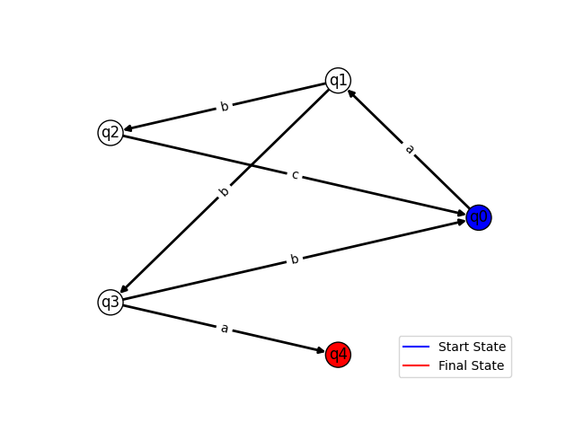
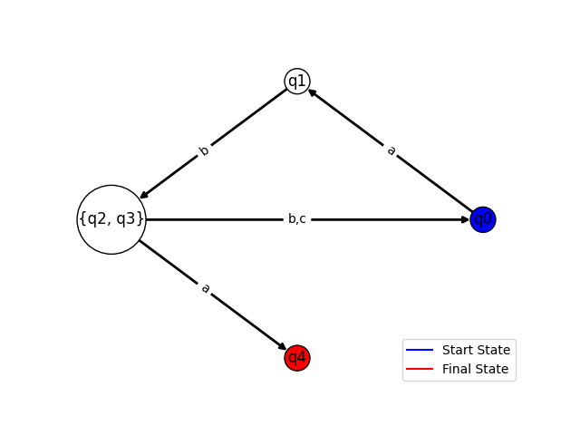

# Intro to formal languages. Regular grammars. Finite Automata.

### Course: Formal Languages & Finite Automata
### Author: Crucerescu Vladislav
### Variant: 9

----

## Theory

There are two key concepts that had to be studied for this laboratory work: regular grammar and finite automata. These concepts are strongly related to each other, they both can produce the same thing, and they can be derived one from another.

The Regular Grammar is defined as follows:

Let: 
V_N be the set of non-terminal symbols
V_T be the set of terminal symbols
P be the set of production rules

Grammar by definition can have different Chomsky Types, there being 4 types labeled as 0,1,2 and 3.
Type 0:
Any form of string conversion.
Type 1:
Conditional string conversion, can't convert to empty string.
Type 2:
Has to have one non-terminal char in the condition string, can convert in any type of string.
Type 3:
Can convert in only the strings of form T,TN or T,NT, where T is in V_T and N is in V_N. 

The Finite Automaton is defined as follows:

Let:
Q be the set of all possible states
Σ be the alphabet
δ be the transition function
q0 be the initial state
F be the set of final states

Finite Automata can be deterministic or non-deterministic. If from a state, using one character, we can transition to two or more different states, then the finite automaton is regarded as non-deterministic. It is possible to convert a non-deterministic finite automaton to a deterministic through the use of an algorithm.

## Objectives:

1. Understand what an automaton is and what it can be used for.

2. Continuing the work in the same repository and the same project, the following need to be added:
    a. Provide a function in your grammar type/class that could classify the grammar based on Chomsky hierarchy.

    b. For this you can use the variant from the previous lab.

3. According to your variant number (by universal convention it is register ID), get the finite automaton definition and do the following tasks:

    a. Implement conversion of a finite automaton to a regular grammar.

    b. Determine whether your FA is deterministic or non-deterministic.

    c. Implement some functionality that would convert an NDFA to a DFA.
    
    d. Represent the finite automaton graphically (Optional, and can be considered as a __*bonus point*__):
      
    - You can use external libraries, tools or APIs to generate the figures/diagrams.
        
    - Your program needs to gather and send the data about the automaton and the lib/tool/API return the visual representation.

## Implementation description

* Grammar Format:

```
Vn = ['S', 'B', 'D', 'Q']
Vt = ['a', 'b', 'c', 'd']
P = [
    ['S', 'aB'],
    ['S', 'bB'],
    ['B', 'cD'],
    ['D', 'dQ'],
    ['Q', 'bB'],
    ['D', 'a'],
    ['Q', 'dQ']
]
grammar = Grammar(Vn, Vt, P)
```

* Chomsky type identifier implementation:

```
types = 4*[0]
types[3] = 1
left = 0
right = 0

for condition, result in self.transition_set:
    len_result = len(result)
    no_result = self.no_elements(result)
    no_condition = self.no_elements(condition)
    if not len_result:
        return 0
    if condition not in self.non_terminal_chars:
        if no_result > no_condition:
            return 0
        types[1] = 1

    elif not types[2]:
        count = 0
        for i in self.non_terminal_chars:
            if i in result:
                count += 1
                non_terminal_in_result = i
        if count > 1:
            types[2] = 1
        elif count and no_result > no_condition:
            pos = result.find(non_terminal_in_result)
            if pos == len_result - len(non_terminal_in_result):
                left = 1
            elif pos == 0:
                right = 1
            else:
                types[2] = 1
            if left and right:
                types[2] = 1
        elif count:
            types[2] = 1

for i in range(4):
    if i == 3 and right:
        return (3,'right')
    if i == 3 and left:
        return (3,'left')
    if types[i]:
        return i
```

This algorithm identifies the type for each transition, then chooses the "lowest" type. If there are type 3 grammar of left linearity and right linearity, means the overall grammar type is 2.

It uses the self implemented no_elements function that identifies how many terminal and non-terminal elements the string has.

```
no = 0
for i in self.non_terminal_chars:
    no += string.count(i)
    string.replace(i, '')
for i in self.terminal_chars:
    no += string.count(i)
return no
```

* Finite Automaton Format:

```
Q = ['q0', 'q1', 'q2', 'q3', 'q4']
sigma = ['a', 'b', 'c']
delta = [
    ['q0', 'a', 'q1'],
    ['q1', 'b', 'q2'],
    ['q2', 'c', 'q0'],
    ['q1', 'b', 'q3'],
    ['q3', 'a', 'q4'],
    ['q3', 'b', 'q0']
]
q0 = 'q0'
F = 'q4'
fa = FiniteAutomaton(Q, sigma, delta, q0, F)
```

* Finite Automaton to Grammar convertor

```
newtransition = []
newnon_terminal = []

for init_state, char, result_state in fa.delta_function:
    if str(result_state) in str(fa.final_states):
        newtransition.append([str(init_state), char])
    else:
        newtransition.append([str(init_state), char + str(result_state)])
    if str(init_state) not in newnon_terminal:
        newnon_terminal.append(str(init_state))

return Grammar(
    newnon_terminal,
    fa.alphabet,
    newtransition
)
```

Takes in Finite Automaton Object and returns Grammar Object

* Finite Automaton determinism identifier

```
if self.determinism:
    return True
count = 0
for init_state1, char1, __ in self.delta_function:
    for init_state2, char2, __ in self.delta_function:
        if init_state1 == init_state2 and char1 == char2:
            count += 1
if count > len(self.delta_function):
    return False
self.determinism = True
return True
```

Returns True or False whether if the Finite Automaton is deterministic or not

* NFA to DFA convertor

```
if fa.is_deterministic():
    print("This Finite Automaton is already deterministic")
    return fa
    
current_states = [fa.initial_state]
newtransition = []
newstates = []
newfinal = []

while len(current_states) > 0:
    temp1 = get_transitions(fa.delta_function, current_states[0])
    temp2 = [[current_states[0], i, []] for i in fa.alphabet]
    for __, char1, result_state1 in temp1:
        for __, char2, result_state2 in temp2:
            if char1 == char2 and result_state1 not in result_state2:
                result_state2.append(result_state1)
    newstates.append(current_states[0])
    current_states.pop(0)
    for init_state, char, result_state in temp2:
        if len(result_state) != 0:
            reduced_final_state = reduce_list(result_state)
            newtransition.append([init_state, char, reduced_final_state])
            if reduced_final_state not in current_states and reduced_final_state not in newstates: 
                current_states.append(reduced_final_state)

if type(fa.final_states) == list:
    for state in newstates:
        for final in fa.final_states:
            if final in state:
                newfinal.append(state)
else:
    for state in newstates:
        if fa.final_states in state:
            newfinal.append(state)

return FiniteAutomaton(
    newstates,
    fa.alphabet,
    newtransition,
    fa.initial_state,
    reduce_list(newfinal)
)
```

Takes in a finite automaton, checks whether it is deterministic, if true, it returns the same finite automaton, else it converts it to a dfa and returns it.

It uses the self implemented get_transitions and reduce_list function.

```
transitions = []
if type(state) == list:
    for component_state in state:
        for init_state, char, result_state in delta_function:
            if component_state == init_state:
                transitions.append([state, char, result_state])
for init_state, char, result_state in delta_function:
    if state == init_state:
        transitions.append([state, char, result_state])
return transitions
```

Takes in a state, then returns the delta_function transitions which have same states to the given state.

```
if len(list) == 1:
    return list[0]
else:
    return list
```

Takes in a list, if a list has one element, returns the element, if it has more, then returns the list.

* Graph representation of the FA

```
f = plt.figure(fig)
color_legend = {'Start State': 'b', 'Final State': 'r'}
ax = f.add_subplot(1,1,1)
for label in color_legend:
    ax.plot([0],[0],color = color_legend[label],label=label)

G = DiGraph()
node_sizes = list()
node_colors = list()
for state in self.all_states:
    newstate = str(state).replace('[', '{').replace(']', '}').replace('\'','').replace('\"','')
    G.add_node(newstate)
    node_sizes.append(100 * (len(newstate)**(1.618033988749894) + 1))
    if type(self.final_states) == list:
        if state in self.final_states:
            node_colors.append('r')
        elif state == self.initial_state:
            node_colors.append('b')
        else:
            node_colors.append('w')
    else:
        if state == self.final_states:
            node_colors.append('r')
        elif state == self.initial_state:
            node_colors.append('b')
        else:
            node_colors.append('w')

edge_labels = dict()
for init_state, char, result_state in self.delta_function:
    source_state = str(init_state).replace('[', '{').replace(']', '}').replace('\'','').replace('\"','')
    destination_state = str(result_state).replace('[', '{').replace(']', '}').replace('\'','').replace('\"','')
    G.add_edge(source_state, destination_state)
    if (source_state, destination_state) in edge_labels:
        edge_labels[source_state, destination_state] += ',' + char
    else:
        edge_labels[source_state, destination_state] = char

pos = circular_layout(G)
draw(G, pos, node_color = node_colors, edgecolors = 'k', width = 2.0, with_labels = True, node_size = node_sizes)
draw_networkx_edge_labels(G, pos, edge_labels)
plt.legend()
```

Prepares the graph of the fa using the networkx and matplotlip python library.

## Results

```
Task 2
Chomsky Type of Grammar is: (3, 'left')

Task 3
Finite Automaton:
    Q = ['q0', 'q1', 'q2', 'q3', 'q4']
    Sigma = ['a', 'b', 'c']
    Delta = 
    ['q0', 'a', 'q1']
    ['q1', 'b', 'q2']
    ['q2', 'c', 'q0']
    ['q1', 'b', 'q3']
    ['q3', 'a', 'q4']
    ['q3', 'b', 'q0']
    q0 = q0
    F = q4

Converted Finite Automaton to Regular Grammar:
    Vn = ['q0', 'q1', 'q2', 'q3']
    Vt = ['a', 'b', 'c']
    P = 
    ['q0', 'aq1']
    ['q1', 'bq2']
    ['q2', 'cq0']
    ['q1', 'bq3']
    ['q3', 'a']
    ['q3', 'bq0']

This Finite Automaton is deterministic: False

Converted Non-Deterministic Finite Automaton to Deterministic Finite Automaton:
    Q = ['q0', 'q1', ['q2', 'q3'], 'q4']
    Sigma = ['a', 'b', 'c']
    Delta = 
    ['q0', 'a', 'q1']
    ['q1', 'b', ['q2', 'q3']]
    [['q2', 'q3'], 'a', 'q4']
    [['q2', 'q3'], 'b', 'q0']
    [['q2', 'q3'], 'c', 'q0']
    q0 = q0
    F = q4
```

This is the result of executing the main.py file

## Screenshots

__Graphical Representation of NFA__


__Graphical Representation of DFA__


## Conclusions

In this laboratory work I implemented a chomsky type identifier from the grammar, a FA to grammar convertor, a determinism identifier for the FA, a NFA to DFA convertor and a way to represent finite automata graphically. The most difficulty I had is with the NFA to DFA convertor, the on paper way of doing it is way easier than the computer algorithm way. The python programming language is perfectly suitable for this task, as is very easy to work with strings and lists with it.